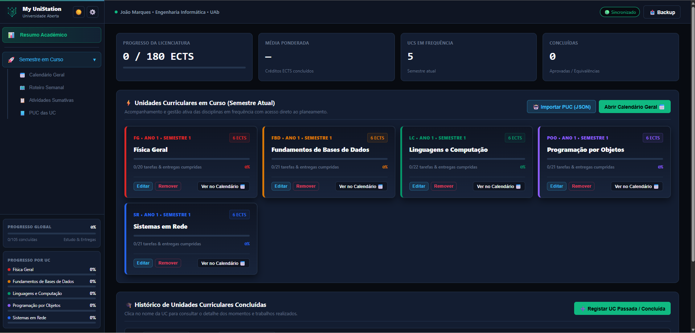
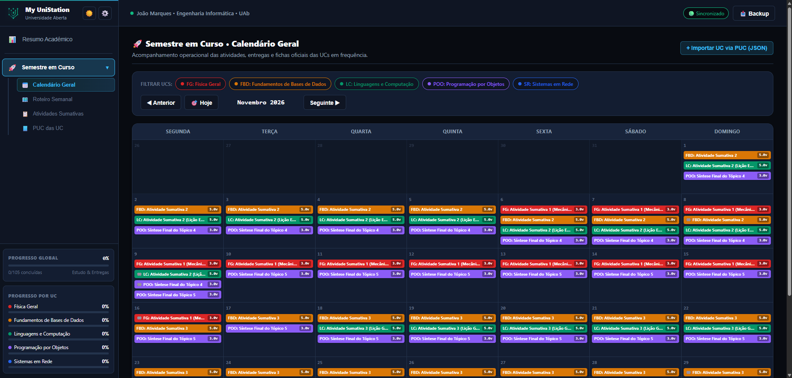
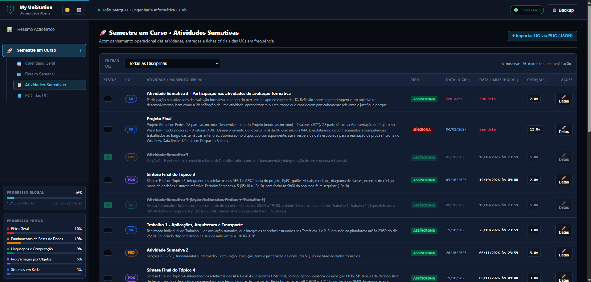
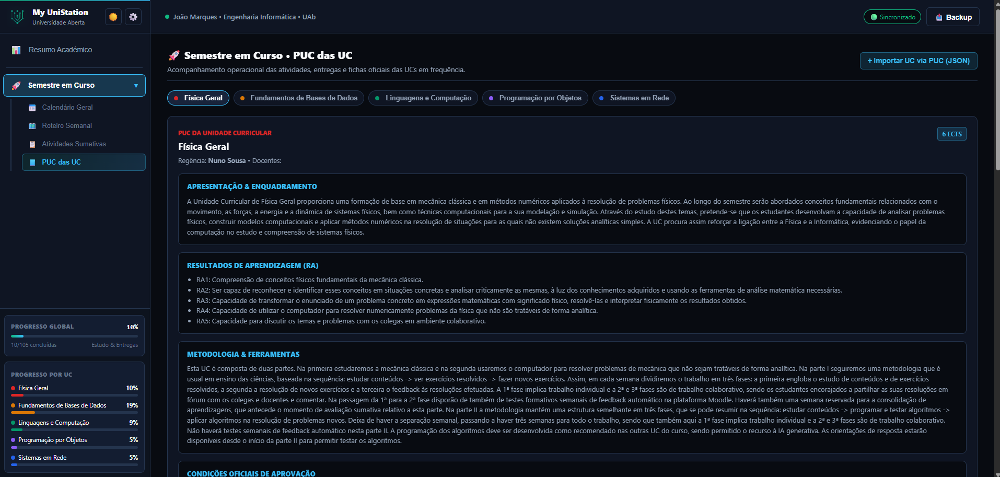
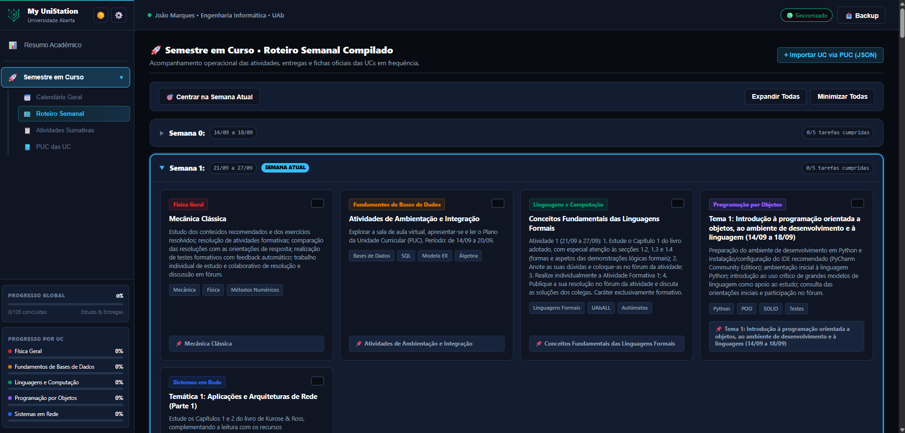
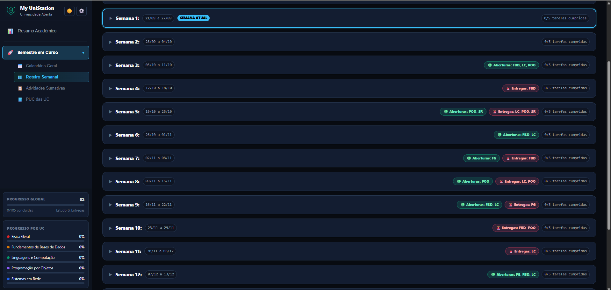

<p align="left">
  
</p>

# My UniStation

> **O teu semestre inteiro, num só ecrã — e todos os que já passaram.**

Dashboard académico **local-first** para estudantes da **Universidade Aberta**. 
Gere o semestre em curso e o histórico de todas as UCs concluídas em semestres anteriores. 
Corre no teu computador, guarda os dados num ficheiro que é só teu, e mostra tudo o que precisas de saber.

[](https://opensource.org/licenses/MIT)
[](https://www.python.org/downloads/)
[](https://github.com/jmarques239/my-unistation)

---
## 🌐 Website
Apresentação visual do projeto em: https://jmarques239.github.io/my-unistation/

Servido via GitHub Pages.

## 📑 Índice

**Começar aqui**
- [🔗 Evolução do `uab-academic-dashboard-generator`](#-evolução-do-uab-academic-dashboard-generator)
- [🚀 Como Arrancar](#-como-arrancar)

**O produto**
- [⚡ Funcionalidades](#-funcionalidades)
- [📸 Screenshots](#-screenshots)
- [🔒 Local-First & Privacidade](#-local-first--privacidade)
- [⚙️ O Que Podes Configurar](#️-o-que-podes-configurar)

**Detalhes técnicos**
- [📚 Documentação](#-documentação)
- [🤖 Desenvolvido com Apoio de Inteligência Artificial](#-desenvolvido-com-apoio-de-inteligência-artificial)
- [📄 Licença](#-licença)

---

## 🔗 Evolução do `uab-academic-dashboard-generator`

O **My UniStation** é a **evolução natural** do projeto anterior [`uab-academic-dashboard-generator`](https://github.com/jmarques239/uab-academic-dashboard-generator).

O conceito original - transformar PUCs oficiais da UAb em informação académica útil - foi **preservado e expandido**. 
A diferença fundamental é arquitetural:

### A mudança de paradigma

| | `uab-academic-dashboard-generator` | **My UniStation** |
|---|---|---|
| **Âmbito** | Um semestre isolado | **Semestre em curso + histórico completo** |
| **Modelo** | Gerador de páginas estáticas (uma por semestre) | **Base modular acumulativa** - um único dashboard para toda a licenciatura |
| **Persistência** | `localStorage` do browser | Ficheiro `data.json` configurável (PC, NAS, Google Drive) |
| **Backend** | Nenhum | Servidor HTTP leve em Python (stdlib) |
| **UCs passadas** | Não suportadas | **Registo histórico com nota, ECTS e regime** |
| **Cálculo de média** | Apenas do semestre | **Média ponderada da licenciatura** |
| **Importação** | Manual | **Assistida por IA + dossiê integral do PUC** |
| **Backups** | Nenhum | Automáticos, com retenção de 5 versões |

### O que isto significa na prática

- **Antes:** geravas um `index.html` novo por cada semestre. Sem visão global. Sem histórico.
- **Agora:** uma única aplicação que **acumula semestres**. Vês a média real da licenciatura, o progresso em ECTS, e o dossiê de qualquer UC ( passada ou presente ) no mesmo sítio.

O My UniStation não é apenas uma versão melhorada do anterior: **é a implementação definitiva do conceito original**, sem as limitações que o formato estático impunha.

---

## ⚡ Funcionalidades

- **Resumo Académico** — Progresso da licenciatura em ECTS, média ponderada acumulada, UCs em frequência e concluídas.
- **Calendário Inteligente** — Timeline mensal com aberturas, prazos e cotação. Uma cor por UC.
- **Roteiro Semanal** — As 17 semanas letivas decompostas, com tópicos, atividades e progresso.
- **Atividades Sumativas & Edição Rápida** — Tabela consolidada de entregas com ordenação multicritério e botão `Datas` para ajustar prazos na hora quando há tolerâncias ou adiamentos no Moodle.
- **Dossiê do PUC** — Transcrição integral do plano de atividades e do calendário oficial de avaliação.
- **Histórico de UCs Concluídas** — Registo de disciplinas passadas com nota final, ECTS e regime. Alimenta o cálculo da média global.
- **Importação via IA** — Extrai o PUC (PDF → JSON) com uma prompt pronta para ChatGPT / Claude / Ollama.
- **Alertas de Prazos** — Avisos configuráveis com antecedência ajustável (1 a 7 dias).
- **Armazenamento Configurável** — Aponta o `data.json` para PC, NAS, Google Drive, OneDrive ou Dropbox.
- **Backups Automáticos** — Retenção dos últimos 5 ficheiros, escrita atómica.
- **Dark / Light Mode** — Tema persistente entre sessões.

--- 

## 📸 Screenshots

### 💻 Vista Desktop
| | |
| :---: | :---: |
| **Resumo Académico** | **Calendário Geral** |
|  |  |
| | |
| **Atividades Sumativas** | **PUC das UC** |
|  |  |
| | |
| **Roteiro Semanal** | **Roteiro Semanal - com alarmistica** |
|  |  |

---

## 🔒 Local-First & Privacidade

- **Nada sai da tua máquina.** Sem contas, sem telemetria, sem analytics.
- **Os dados são teus.** Um único ficheiro `data.json` que podes abrir, copiar, versionar ou apagar.
- **Zero lock-in.** Formato JSON universal. Migrar para outra máquina é copiar o ficheiro.
- **Sem dependência de clouds.** Não precisas de internet para usar a aplicação.

---

## 🚀 Como Arrancar

**Requisito único:** Python 3.9+ (o resto é biblioteca padrão).

### Via Python direto

```bash
git clone https://github.com/jmarques239/my-unistation.git
cd my-unistation
python3 app.py
```

Abre `http://localhost:8080` no browser.

### Via launcher automático

- **Windows:** duplo clique em `my_unistation_win_launch.bat`
- **Linux / WSL:** `chmod +x my_unistation_linux_launch.sh && ./my_unistation_linux_launch.sh`

Os launchers detetam o Python automaticamente, instalam-no se necessário (via `winget` no Windows, ou o gestor de pacotes da distro no Linux), e arrancam o servidor.

📖 **Instruções completas, troubleshooting e detalhes dos launchers:** vê o [`docs/GETTING-STARTED.md`](docs/GETTING-STARTED.md) e o [`docs/TROUBLESHOOTING.md`](docs/TROUBLESHOOTING.md)

---

## ⚙️ O Que Podes Configurar

Tudo está acessível na **⚙️ Definições do Sistema**, dentro da própria app.

### 👤 Perfil
Nome do aluno e licenciatura. Aparece na barra superior da aplicação.

### 🔔 Notificações
- **Motor de notificações** — Ligar / desligar por completo
- **Janela de antecedência** — 1 a 7 dias antes do prazo
- **Lista de silenciados** — UCs que não queres ser avisado
- **Teste de alerta** — Botão para validar visualmente

### 🗄️ Armazenamento
- **Caminho do `data.json`** — Define onde vivem os teus dados
- **Pré-visualização antes de alterar** — Mostra lado-a-lado o ficheiro atual e o destino, com nº de UCs, tamanho e data de modificação
- **Confirmação explícita** — Nunca sobrescreve nada sem perguntar
- **Backup automático** — Qualquer ficheiro substituído é renomeado para `.backup-<timestamp>` (retenção de 5)

### 💾 Backup
- **Descarregar estado completo** — Um clique gera um JSON com tudo
- **Restaurar de um ficheiro** — Importa um backup anterior

---

## 📚 Documentação

| Documento | Conteúdo |
|---|---|
| [`docs/GETTING-STARTED.md`](docs/GETTING-STARTED.md) | Requisitos, instalação detalhada, launchers automáticos |
| [`docs/TROUBLESHOOTING.md`](docs/TROUBLESHOOTING.md) | Problemas comuns e como os resolver |
| [`docs/FILE_LOCATION.md`](docs/FILE_LOCATION.md) | Onde ficam os ficheiros e como movê-los |
| [`docs/ARCHITECTURE.md`](docs/ARCHITECTURE.md) | Diagrama, API HTTP, garantias técnicas, estrutura do projeto |

---

## 🤖 Desenvolvido com Apoio de Inteligência Artificial

Este projeto foi **integralmente executado com apoio de inteligência artificial** — desde o código Python, à SPA embutida, aos launchers, ao website de apresentação.

Mas é fundamental ser honesto sobre o que isto significa:

> **A arquitetura, os requisitos técnicos e as decisões de design foram definidos pelo humano antes de qualquer linha de código ser escrita.** 
A IA foi usada como motor de implementação, não como arquiteto.

### O que isto prova sobre IA em 2026

Este projeto serviu deliberadamente como **teste às capacidades atuais da IA** e à sua capacidade de implementar software real. O resultado foi claro:

- ✅ **A IA é hoje capaz** de materializar um projeto desta dimensão e complexidade — quando recebe requisitos claros, estruturados e detalhados.
- ❌ **A IA não é capaz** de o fazer sem orientação precisa. Sem *guard rails* bem definidos, sem requisitos específicos e sem validação incremental, o resultado teria sido fragmentado, inconsistente ou simplesmente errado.

A conclusão prática: **os guard rails têm de ser precisos e o mais pormenorizados possível**. A IA não substitui o arquiteto e o programador — amplifica-os. E quanto melhor for o briefing, melhor será o produto final.

### Master Prompt

Para transparência e reutilização, a **master prompt** usada para iniciar este projeto está disponível em:

📄 [`prompt/MASTER_PROMPT.md`](prompt/MASTER_PROMPT.md)

Contém os requisitos técnicos, funcionais e arquiteturais definidos antes do início da implementação. Serve como exemplo de como estruturar um briefing para um projeto assistido por IA — e como demonstração prática do nível de detalhe necessário para o sucesso.

---

## 📄 Licença

Distribuído sob a **MIT License**. Vê o ficheiro [`LICENSE`](LICENSE) para os detalhes.

Podes usar, modificar e distribuir livremente — em contexto pessoal ou comercial.

---

> **My UniStation é o teu semestre inteiro, transformado em clareza — sem perderes a posse dos teus dados.**

Feito com ♥ para estudantes da Universidade Aberta.
